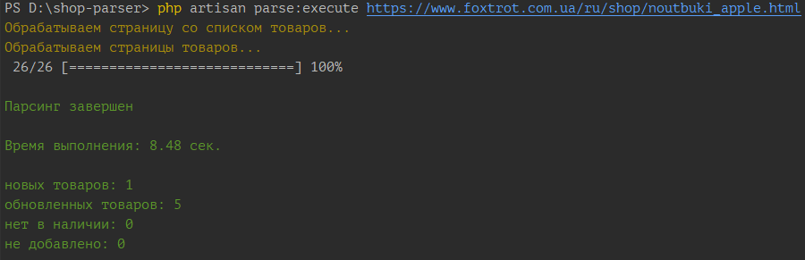
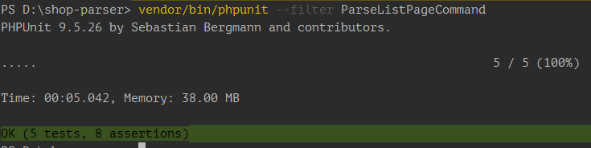

## Shop Parser

- парсер получает в качестве параметра ссылку на страницу с товарами, например [https://www.foxtrot.com.ua/ru/shop/stiralki_whirlpool.html](https://www.foxtrot.com.ua/ru/shop/stiralki_whirlpool.html), получает ссылки на товары, переходит по ним и получает данные о товаре, сохраняет в базу данных.
- можем парсить разные магазины в одну базу товаров
- предполагаем что все цены указаны в одной валюте - гривне
- если цена пустая - помечаем продукт как "нет в наличии"
- фотографии товара не сохраняем

### Установка
1) git clone https://github.com/partenit/shop-parser
2) composer install
3) .env.example скопировать в .env. По умолчанию настроено подключение к базе данных sqlite, но можно настроить подключение к базе данных в соответствии с параметрами сервера
4) php artisan key:generate
5) php artisan migrate

### Использование


1) для парсинга в консоли запускаем команду

```php artisan parse:execute с параметром - ссылкой на страницу с товарами``` 

можно добавить поцию ```--limit=xx```, чтобы ограничить количество товаров, которые будут обработаны. По умолчанию лимита нет.


2) чтобы посмотреть данные товара по его коду, запускаем команду

```php artisan parse:object_data ххххх, где ххххх - код товара```

### Тестирование
php artisan test

или

vendor/bin/phpunit (лучше показывает прогресс)



### Особенности реализации:
- это консольное приложение, на базе Laravel 9.4
- для парсинга страницы используем библиотеку [HtmlDomParser](https://github.com/voku/simple_html_dom)
- один интерфейс
- один абстрактный класс - в нем основная логика
- на базе абстрактного класса создаем сервис-классы для каждого магазина
- для логирования кодов http отличных от 200 и отправки email для 503 используем Event/Listener
- почта шлется через очередь

### ToDo
- добавить тесты
- для ускорения использовать параллельные запросы от http клиента [https://laravel.com/docs/9.x/http-client#concurrent-requests](https://laravel.com/docs/9.x/http-client#concurrent-requests)
- портировать на Symfony 6.1


